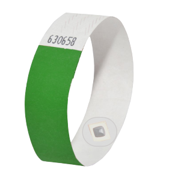
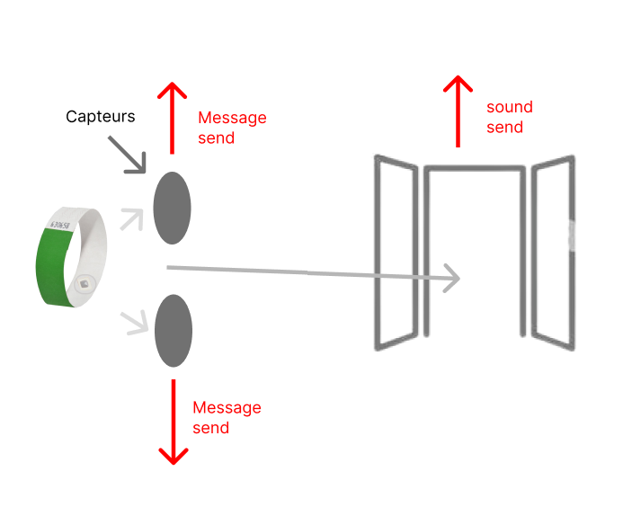

# moonshot project

## Idea

My idea is to create a device for patients in hospitals. That would allow to know if a patient tries to leave the hospital without authorization.

## Sector

The target sector is the medical sector. We are therefore targeting hospitals, maternity hospitals, epads, …

## Material

## Representation of the product

part visible :

## Representation in real time

<!--Not captor is sensor -->