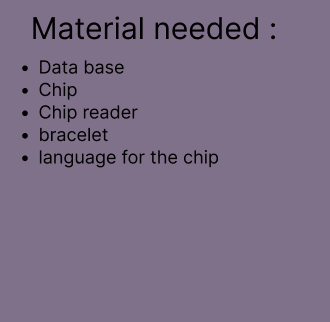
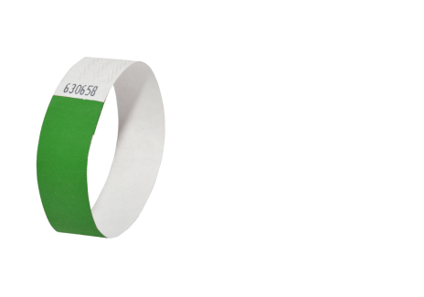

# moonshot project

## Idea

My idea is to create a device for patients in hospitals. That would allow to know if a patient tries to leave the hospital without authorization.

## Sector

The target sector is the medical sector. We are therefore targeting hospitals, maternity hospitals, epads, …

## Material

## Representation of the product

part visible :

## Representation in real time

<!--Not captor is sensor -->

| resaerch| link |
|:---:|:----:|
|  | [Bracelet d'identification TYVEK 3/4"](https://www.wristbands.fr/merchant/bracelets-identification-tyvek-34/100/?gclid=Cj0KCQiAgOefBhDgARIsAMhqXA6p03VUevSETxFqBeWzfHYHWVb-E3vTv7GATYqdD8oVhlFS11C7glAaAvPFEALw_wcB)  |
|  | [bague nfc intelligente simulation puce pour téléphone électronique grande vitesse cadeau noël 9](https://www.cdiscount.com/telephonie/accessoires-portable-gsm/bague-nfc-intelligente-simulation-puce-pour-teleph/f-1442044-ywe7755760470022.html?idOffre=1695333593&cid=search_pla&cm_mmc=PLA!COR!!MP!17321694237!m257905728_pYWE7755760470022-1695333593_l9109587_tpla-294682000766_&gclid=Cj0KCQiAgOefBhDgARIsAMhqXA45hVJ0BH9SnOu7EcsmwXWYxA3LVm7R6f1InoCCAx8NByYswTbKfmgaAtuLEALw_wcB)  |
|  |  [Tag PVC NFC NTAG 213 (x25)](https://www.barcoda.fr/143911-tag-pvc-nfc-ntag-213.html) |
|  |  [Tomst T-IBUTTON puce D'identification individuelle Vigilante.](https://www.google.com/shopping/product/5161846610973118022?q=petit+puce+electronique&rlz=1C1GCEA_enFR1025FR1025&sxsrf=AJOqlzVerB6W71d9D0NWi3WL3VabqyOatQ:1677331558130&biw=960&bih=392&dpr=1.5&prds=eto:9031401290636662393_0,pid:10643921758077952976&sa=X&ved=0ahUKEwj4uruB47D9AhWuTaQEHQEeBGIQ8wIIlA0) |
|  | [Petsafe clé supplémentaire pour PPA19-16145 - Blanc - pour](https://www.google.com/shopping/product/13632491444528934159?q=petit+puce+electronique&rlz=1C1GCEA_enFR1025FR1025&sxsrf=AJOqlzVerB6W71d9D0NWi3WL3VabqyOatQ:1677331558130&biw=960&bih=392&dpr=1.5&prds=eto:7153973137217946132_0,pid:12114368639612798793,rsk:PC_6375565438259048380&sa=X&ved=0ahUKEwj4uruB47D9AhWuTaQEHQEeBGIQ8gIIyQ0oAA)  |
|  |  [Azdelivery 5 x Kit RFID RC522 lecteur, puce et carte 13.56MHz spi Compatible](https://www.google.com/shopping/product/10494187643556233939?q%3Dpetit%2Bpuce%2Belectronique%26rlz%3D1C1GCEA_enFR1025FR1025%26sxsrf%3DAJOqlzVerB6W71d9D0NWi3WL3VabqyOatQ%3A1677331558130%26biw%3D960%26bih%3D392%26dpr%3D1.5%26prds%3Deto%3A11929282744985730928_0%2Cpid%3A4186780214825409048%2Crsk%3APC_2438712341516735826%26sa%3DX%26ved%3D0ahUKEwj4uruB47D9AhWuTaQEHQEeBGIQ8wII3Q0) |
<!---|  |   |
|  |   |
|  |   |
|  |   |
|  |   |
|  |   |
|  |   |
|  |   |
|  |   |
|  |   |
|  |   |
|  |   |
|  |   |
|  |   |
|  |   |
|  |   |
|  |   |
|  |   |
|  |   |
|  |   |
|  |   |
|  |   |
|  |   |
|  |   |
|  |   |
|  |   |
|  |   |
|  |   |
|  |   |
|  |   |
|  |   |
|  |   |
|  |   |
|  |   |
|  |   |
|  |   |
|  |   |
|  |   |
|  |   |-->

Same principe as [Chatière à puce électronique Petsafe](https://www.google.com/shopping/product/7712606336368844363?q=petit+puce+electronique&rlz=1C1GCEA_enFR1025FR1025&sxsrf=AJOqlzVerB6W71d9D0NWi3WL3VabqyOatQ:1677331558130&biw=960&bih=392&dpr=1.5&prds=eto:7841228131257221809_0,pid:6201393743964348030,rsk:PC_6552024401063025065&sa=X&ved=0ahUKEwj4uruB47D9AhWuTaQEHQEeBGIQ8wIIlQo)